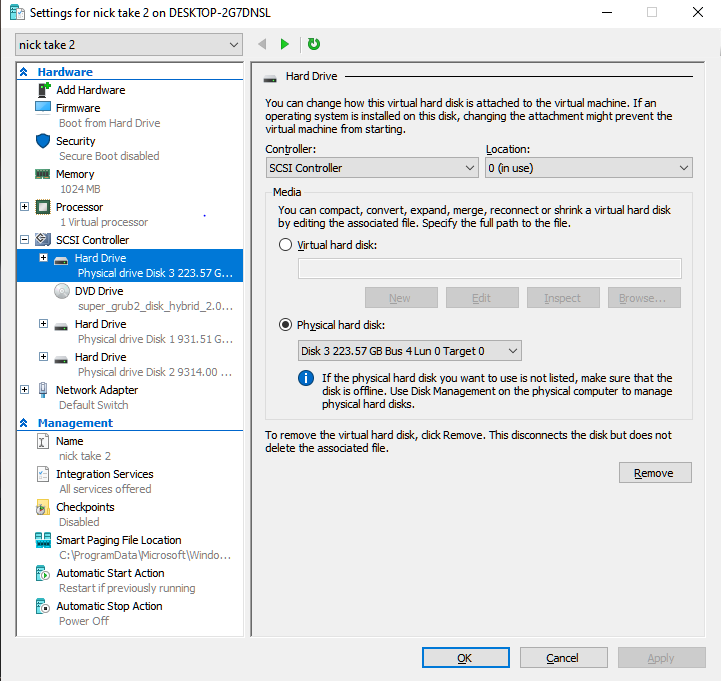

# Running Native Linux install as a VM using HyperV

Some days back I assembled a top of the line(ish) workstation for working on hobby projects and gaming. I bought the latest and greatest processor (Ryzen 3900x - 12 Core 24 Threads) from AMD and 32 GB of RAM for a no-compromises experience. I assembled the PC and it was blazing fast. I configured the system to run Windows and Linux (PopOS) using dual booting. I already had an SSD from a previous build that had the Linux OS installed and configured. I had my Twitter crawls set up on it and other services set up and working on it. I used Linux for Productivity and Windows mostly gaming as is the custom.

After some time, I realized this arrangement came with a very obvious drawback. Whenever I used to game, my Twitter crawls and other services in Linux, were effectively shut down. To solve this issue, I changed the boot order to set the Linux OS to boot by default. Even then, I wasn't ready to accept this tradeoff when I had a processor that was more than capable of handling both of these OSes at the same time. If I were to somehow manage, to virtualize the existing Linux installation I had, the CPU I bought wouldn't even break sweat handling both my OSes at the same time. I am also lazy and found it very hard to switch off a running OS and switch to the other one frequently. I just wanted to reduce my overhead. 

So summarizing the above, I wanted to boot the already existing Linux installation I had on a different SSD as a guest VM in windows. I already had a Windows 10 Professional version so, the choice of hypervisor was easy, as this particular version of Windows comes with Hyper-V. The challenge here is booting from an actual hard disk instead of a virtual hard disk. The problems with the above approach are 

1. Passthrough the hard disk (having Linux installation) directly to the VM
2. Boot from this hard disk by using virtualized GRUB media
3. Solve other issues for smooth operation

## Enabling virtualization and HyperV

The first step in this process is to activate Virtualization features from the BIOS and enable it in Windows. In my case, it was a simple setting in BIOS called Secure Virtual Machine Mode (SVM) which when enabled allows you to use HyperV in Windows. Enabling HyperV in Windows is then straight forward. Follow the below steps to activate HyperV.

1. Search Windows Features in the Windows search bar.
2. Click the checkbox near Hyper-V. Press OK and you should be done.
3. Windows will restart once to enable this feature.


## Passing through the SSD to VM
The next challenge here is to make sure the actual media (SSD in my case) is passed through without interference to the VM we create. You have to make sure Windows is not using this media and forwards it cleanly to our target VM. 
### Make the device offline in Windows
To make sure that the media we are passing to the new VM is not being used by the host OS, we need to make sure the disk is offline. You can do that by doing the following steps. 
1. Open the Disk Management tool by searching for it in the Windows search bar.
2. All your disks should appear at the bottom along with all the partitions in the bottom. 
3. Go to the Linux media you want to forward (the drive which has Linux installed on it) and left-click on it. You'll get an option to make this device offline, click on it. Now the disk should be offline and the UI should be reflecting the change.


### Create a VM using HyperV
Once you complete the above step, you need to create a VM using HyperV. Go to HyperV Manager and create a new VM. Create a new VM with all the necessary configurations like memory and CPU cores. While creating a new VM make sure that you select generation 2 (No specific reason just seems newer and better suited to me) in the Specify Generation section and in the Connect Virtual Hard disk section select the "Attach a Virtual Hard disk later" option. Once you do that your VM should be created. To mount our Linux media and make sure we can boot to it we need to do a device passthrough to the VM.
1. Go to the settings of the newly created VM, under the SCSI controller section you need to add a Hard disk.
2. In the media section your Linux HDD should show up under the Physical Hard disk section. Select the Hard disk and click apply.
3. Mount any other disks if needed. 
4. Download the SuperGrub 2 disk image from [here](https://www.supergrubdisk.org/super-grub2-disk/)
5. In the DVD drive under the SCSI section select the recently downloaded ISO as an image file. 


SuperGrub2 helps us to solve the issue of not finding the GRUB partition as we are booting in a VM. We use SuperGrub2 to boot into our Linux install.  

Once you are done, keep the DVD drive boot priority highest. 

## Disable Snapshots

HyperV won't allow you to boot the created VM as the HyperV Manager cannot create a snapshot. This is because our installation media is an actual HDD instead of a virtual one. You can disable Snapshotting by going to the VM settings -> Management -> Checkpoints and deselect the "Enable Checkpoints" check box. 

## Boot into the Linux VM

Once you are done with the above steps you can spin up the VM and you should be able to boot into the SuperGrub Menu. In this menu select the "Detect and show boot methods" entry.


You should then be able to select your Linux version and be able to boot into it. 

## Configure the display driver
If you were using Nvidia proprietary drivers on the existing Linux installation you'll need to remove them. Once you do that you need to install the xserver-xorg-video-fbdev package to make xorg server work.

```bash 
sudo apt-get install xserver-xorg-video-fbdev 
```

I also added an x11 configuration file which might or might not have helped. Adding it just in case this might help someone. Create a new file /etc/X11/xorg.conf.d/30-hyperv.conf and add the below snippet to it. 

```bash
Section "Device"
 Identifier "HYPER_V Framebuffer"
 Driver "fbdev"
EndSection
```

I wasn't able to boot into the GUI (though CLI is still accessible) without the above fixes. Once you do that and reboot you should be able to boot into the Linux GUI. 

# Conclusion

Congratulations! you now have a Virtualized version of your Linux Installation which can be accessed inside your Windows OS. The advantage of this approach is you can still normally boot into the Linux OS and all your changes are consistent across both VM and the actual Linux system as the media is the same. The only problem I can see is enabling GPU drivers. In the future maybe I can dynamically switch the display drivers based on the context.

This method also won't work if your Linux install exists on the same Hard disk. I feel in that case just converting the whole partition to a VHDX file would be easier. This method has its own drawbacks like the data won't be consistent across both instances. 


