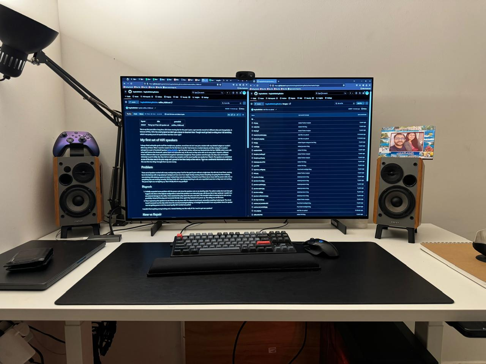

This is my first post after a long time. Life's been moving fast for the past 2 years, I got married, moved to 2 different cities and changed jobs. In between all this, I did a few small projects but didn't get a chance to document them. Thought would get back to writing since I did something which I was pretty proud of myself, Better late than never right?
# My first set of HiFi speakers
I always liked audiophile grade stuff like headphones, speakers, sound bars etc but I was just a student with very limited budget so I couldn't afford any of them. When I went for master's for the first time in my life I had access to a modest stipend, and after saving for 2 months I splurged on a pair of bookshelf speakers [Edifier R1280Ts](https://edifierindia.com/products/edifier-r1280dbs-active-bluetooth-bookshelf-speakers-brown). I got the basic version, without any  bluetooth (the link has 1280DBs which come with value add features like bluetooth, optical input and subwoofer out). As life went on they came with me to every place I stayed in, different hostels, different cities once I graduated (Aurangabad, Hyderabad, bangalore). These speakers went through a lot, they were not handled delicately to put it mildly. But, they held on without any complain and the sound quality was exactly how I liked it. The speakers are established as one of the nicer ones in the price range and I growed to love them dearly as time went on. There was a sentimental attachment as well since this was first nice thing I brought from my own money. 

# Problem
These set of speakers worked with every work/gaming setup I had for the past 8 years without a single issue. My wife also loved them, evening tea in the balcony with songs playing in background was one of our staple Sunday evening rituals. Everything was going fine then suddenly, one evening while playing a game on setup I noticed they were not working. I checked to see if there was an issue with the power cable, but no everything else was working correctly. Did they finally die? I was trying everything to rule out a superficial cause but no they were not working. The power light was not lighting up. Was it finally time to say goodbye?

## Diagnosis
1. I initially suspected some problem with the power cord, since the speakers rest on my standing desk. The cable is really short and does get tugged a bit when at the highest configuration (I solved this problem in an interesting way, will discuss this in later sections). I couldn't see any external damage to the cable, I then examined the plug where the pins were bent. This shouldn't affect it working but to rule out any possibility I sliced off the plug and connected directly wires, again they refused to be power up. The wiring was not the issue.
2. Then I opened up the speakers to see if there was any issue with the internal circuit board, outwardly everything looked good. The circuit board I accessed was the chip which does the sound processing/amplifying. In hindsight this shouldn't have any problem since the speaker was not getting power at all, the sound quality till it worked was perfect 

I couldn't find anything wrong looking at it, I started thinking was this really it? Do I need to get new speakers?

# New vs Repair
I began thinking about buying the new Improved model linked above the 1280DBs since they were better in everyway and I had growing doubts on my ability to repair my pair of 1280T's. The speakers looked perfect, I had a birthday gift pending from my sister so I could really chuck these out and buy a spanking new set of speakers. Also given that these lasted an amazing 8 years, I was happy with their long service. Seriously, 8 years is the most any electronic equipment has lasted for me. 
But the thought of throwing these away was gnawing at me. The speakers were still pristine from inside, had no major or even cosmetic defects. Audiophile grade gear is supposed to last a lifetime according to people on reddit, why did this particular set fail? . Then the sentimental aspect kicked in and I got even more determined. I would try my best to rescue these set of speakers, My First set of Speakers!. The environmental aspect isn't something I gave a lot of importance in the past but as i'm beginning to grow old, it does hurt a little throwing stuff in garbage. The quantity of packaging material I throw out has also being causing some churn in me. This was not the only factor but it was one of the factors why I thought of spending sometime to fix the speakers. 
I told my sister, I'll save her 15k Rs and started searching for more information about this problem

# Zeroing down
I started to look for more information on this problem since these are pretty popular set of speakers. If I had this problem definitely someone else might've run into same issues. I then saw [this](https://www.reddit.com/r/audiorepair/comments/13fqhv8/edifier_r1280_speakers_wont_power_up/) post on reddit and it was exactly what I needed! OP there pointed out to check the capacitor on the power board and see if it has gone bad. I started looking at the board and I stupidly looked at the amplifier board first, thinking OP was talking about capacitors on this board. Once I realised he wasn't talking about this board but the power supply board. 

## Unscrewing the power board
Unscrewing the power board was a task in itself, I had to open both front and rear parts of the wooden housing. To make matters worse the PSU board was attached by a screw and bolt which was hard to lock down. I managed to use a drill socket from my bosch drill to hold it down and unscrewed it. Once it was out I could see the capacitor in question was very slightly bulged. 

## Found the culprit!
I found the exact capacitor which the reddit thread talked about and lucky for me it looked slightly bulged. Lucky because it avoided my digging around with a multimeter to find the failing component. I de-soldered the capacitor and the capacitor had broken down completely, the terminals were corroded and it was barely held in place by the remaining terminal.

# Finding replacement
Finding replacement was not that heard I looked at the capacitor specification(68uf, 400V) and found an exact match at [ElectronicsComp](https://www.electronicscomp.com/68uf-400v-electrolytic-capacitor?gad_source=1&gclid=CjwKCAjwps-zBhAiEiwALwsVYeCJGdlaodnxbyzKY1dq8gBPEnt4XWcTT6lW3ejfETulxqFSHv8Z0hoCjCkQAvD_BwE). I placed an order and instead of delivering 400V capacitor they delivered capacitor with 450V rating. I read about it and turns out there are no disadvantages in going for a higher rated capacitor than required. 

# Soldering it on
Once everything was ready I plugged in my trusty old soldering gun and started my task. This took less than 5 mins since everything was pretty straightforward. You can see the pic of the board after soldering the capacitor below. 

# It's Alive!
Once everything was soldered I plugged in the cord to mains and it WORKED! the power LED immediately lit up and I was ecstatic!. Told my wife and sister what I did and they were pretty impressed. Finally assembled everything and played some of my choicest tunes and the speakers were flawless as before. I absolutely adore these set of speakers and would like to endorse them to anyone who's looking to upgrade. 

# Maker's High
The aim with this project was to get the speakers working because of sentimental reasons but fixing something with your bare hands gives you a different high. Especially given most of my work is in the software world, where the code/ideas/work are all abstract and stored as bytes somewhere. Some things I accomplished as part of this process
* Saved a bunch of money: seriously I spent 32 INR on a capacitor vs ~10000 INR for a new set of speakers
* Learnt about electronics: especically speakers are indestructible if they are of decent quality
* Open things up to see whats wrong: If you are going to throw them away anyways whats the harm in opening them up? worst case scenario you mess them up even more. You were anyways going to throw them away right?
* Makers High keeps the curiosity flowing in life: Fixing something invokes a sense of joy which is hard to describe. Feels immensely satisfying. 
