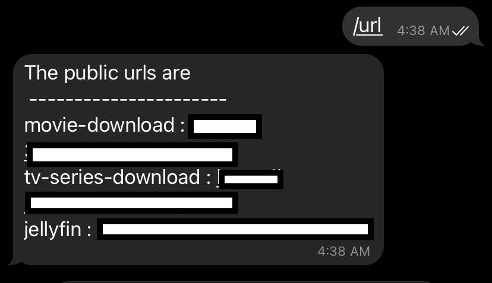

# How do you expose your local service to the internet?
Ever since I started self-hosting my services, I was always looking for good ways to expose them over the internet. There are many ways to do this, but all of them come with some limitations. I'll try to discuss them in short and then discuss the solution I found the most effective.

## Why you should?
There are many reasons for exposing services over the internet. One of the most common ones is your friends or clients might want to check out your web app or download a file. My use case was simple, I wanted my friends to access my services over the internet.

## Why you shouldn't
Exposing any incoming connections to your computer is almost always a bad idea. There is a high chance of it being compromised by attackers who are always on the lookout for vulnerable systems. This is also why many people place their servers behind cloud flare routing infrastructure. Exposing your personal server is worse because a skilled hacker might be able to infiltrate your home network without you even knowing.

# The Easiest way (Paid)
The easiest way to accomplish the above is getting a paid service. If you don't want to play around and want a reliable way to expose your service, getting a paid subscription isn't a bad idea. 

## Ngrok (Paid version)
Ngrok has various tiers and the cheapest one is for 5$/month. It comes with custom subdomains that will help you get a static URL to point your friends to. This is an easy to use option and relatively safe since you just expose the service over the internet. 

## Exposing your whole server
You can allow incoming traffic to your server directly by enabling port forwarding and reserving a static IP from your ISP. This is generally not a problem on traditional ISPs, but new generation fibre plans like Jio fibre or airtel Fibre put you behind a NAT which complicates this. My understanding is ISPs like Jio fibre won't allow port forwarding but there are examples of people managing to do [this](https://broadbandforum.co/t/160941/page-4#post-1437388) (I doubt it though, the user is the only one who managed to do this on the forum). In that case, you may have to pay some additional charges to the ISPs.

## Reverse SSH tunnelling
If you are not able to get a static IP the next best thing is reverse ssh tunnelling which uses ssh to login to a remote server with internet access and opens a tunnel back to your system. This solution is genius in the way that you just need the public IP of the server which is exposed to the internet and the ssh command will take care of tunnelling. The drawback here is you need to have a server that acts as a proxy to relay back the internet traffic. I found two alternatives for this problem

### Setup a free google cloud VM
Google Cloud offers a free tier that you can use to get a VM with public IP. The free tier works well as we need the VM to just redirect the traffic. It has its own drawbacks though
1. Free tier VMs are located in the US region which pushes the latency through the roof. If you are streaming data this will cause it to slow down to a crawl. In general, any application will be useless due to the distance the packet has to travel. 
2. Static IP will not be available in the free tier. You get a public IP to access the services but resets every time you restart the VM. This means every time your friends need to access your services they'll need to ping you to get the public IP. 
3. The gcloud command requires authentication and in general, is hard to automate using a systemd service. This meant more often than not I had to manually ssh to the VM.

### Use a service like localhost.run
You can alternatively use a service like [localhost.run](http://localhost.run/). The problem here is these services aren't reliable and stop working suddenly. Serveo was a similar service that went down. The other problem is again these services are hosted in the US or EU region which makes them impossibly slow in India. 

# Free and most performant way
The solution I finally went with uses Ngrok free tier with some scripting to make the service persistent and easy to use. The major advantages of this method are 
1. Ngrok free tier provides up to 4 tunnels which are more than enough for homelab purpose. You can also run a reverse proxy to expand this to access an unlimited amount of internal services. 
2. Ngrok allows you to set region as India which gives up to 5x boost in speed compared to the US region. This benefit alone makes it worth switching to Ngrok as no other alternative allows this in a free tier. 
3. Ngrok has a local API which makes it easier to automate this service. You can easily get the public IPs by querying the endpoint 
4. Doesn't cost a thing and that's a big advantage in my books
 
Though this service has many advantages it comes with a pretty big disadvantage. Ngrok in its free tier doesn't allow you to fix the subdomain name. This means the URL changes every time you restart ngrok. To solve this issue I came up with a hack, I created a telegram bot that will return the public URLs whenever you ping it with the `/url` command. This works well enough for my limited use case and doesn't cost a thing! The only problem here is creating a telegram bot and making it persistent so that it starts up with the system. Luckily I've managed to hack together a bot that will do that for you, you can access the repository [here](https://github.com/bagdeabhishek/telegram_bot)

## Steps to enable these services
These are the steps you need to follow to enable this system.
### Installing Ngrok
Installing Ngrok is as easy as downloading the file and running it. You can download Ngrok from [here](https://ngrok.com/download) and follow the instructions to start running Ngrok directly. Since we want to run this as a service we will need to follow some extra steps.
#### 1. Create a configuration file
To avoid adding multiple command-line arguments while running Ngrok we create a configuration file. The configuration file should be at `/home/user-name/.ngrok2/ngrok.yml`. You can edit it to specify the tunnels and the configuration needed. As an example, this is my configuration file 

```yaml
authtoken: <your-auth-token> # get this token once you register on ngrok.com
region: in # set the region closest to where you are, this makes a big difference on the speed
log_level: info
log_format: json
log: /var/log/ngrok.log # log location if not set, the logs will be output on the screen
tunnels:
        service1:
                proto: http # type of service can be tcp, udp or http 
                addr: 1234 # the port of the service on localhost
                bind_tls: true # required to start the service as https only, set false to start as http and omit it for both
        service2:
                proto: http
                addr: 8000
                bind_tls: true
        service3:
                proto: http
                addr: 1111
                bind_tls: true
```
Save this and you should be able to start all the tunnels with `./ngrok start --all`. 

#### 2. Make service persistent with a systemd service
Once you've set up ngrok you need to create a systemd service to start the tunnels at boot. You can copy the following configuration in a file called `ngrok.service` in `/etc/systemd/system/` folder. 
``` ini
[Unit] 
Description=Ngrok
After=network.service

[Service]
type=simple
User=abhishek
WorkingDirectory=/home/<user-name>
ExecStart=/path/to/ngrok start --all --config=".ngrok2/ngrok.yml"
Restart=on-failure

[Install]
WantedBy=multi-user.target
```
Once you save it, enable the service using `sudo systemctl enable ngrok.service`. This will make the service start on boot which is what we want. You can also manually start the service using `sudo systemctl start ngrok.service`
 

### Telegram bot to get the public URLs
The major drawback of using Ngrok free tier is that you cannot reserve a subdomain. This means the URL of the tunnel changes every time you run the service. To solve this issue I managed to create a telegram bot that will fetch the public-facing URLs from ngrok using its API and return them as a message. This works well for my use case as my friends can directly ping the bot and get the current URLs. It also provides an added layer of security since there is no static URL for malicious actors to target. 

#### 1. Create a telegram bot
Chat with @botfather on the telegram app to create a bot. Copy the BOT_TOKEN for reference. 

#### 2. Run the telegram bot
I have created a simple bot that works well enough for our purpose. Clone [this](https://github.com/bagdeabhishek/telegram_bot) repository to get the telegram bot code and you can run it directly using python. 
1. To make this work you need to set the bot token you got from the previous step as an environment  variable. You can do that by running `export BOT_TOKEN="<token-id>"` command. 
2. CD into the repository directory `cd telegram_bot;`
3. Run the command using python by `python3 bot-telegram.py`

The bot should be running now and you can test it by typing `/url` in the telegram chat with the bot. You should get a response similar to the one below.



#### 3. Persist the bot operation using systemd
Once the bot is running we can make it run at boot using systemd. We create a systemd service that will launch at boot. The process is the same as the one in making the Ngrok systemd service. I'll paste my systemd configuration here for reference

```ini
[Unit]
Description=Telegram bot to return URLs
After=ngrok.service

[Service]
type=simple
User=abhishek
Environment="BOT_TOKEN=<token-id>"
WorkingDirectory=/path/to/bot/repo/
ExecStart=/usr/bin/python3.8 /path/to/bot/repo/bot-telegram.py
Restart=on-failure

[Install]
WantedBy=multi-user.target
```

Hopefully, now you should be able to get the URLs to your local service anywhere in the world by pinging the telegram bot. Do ping me if you have any issues.